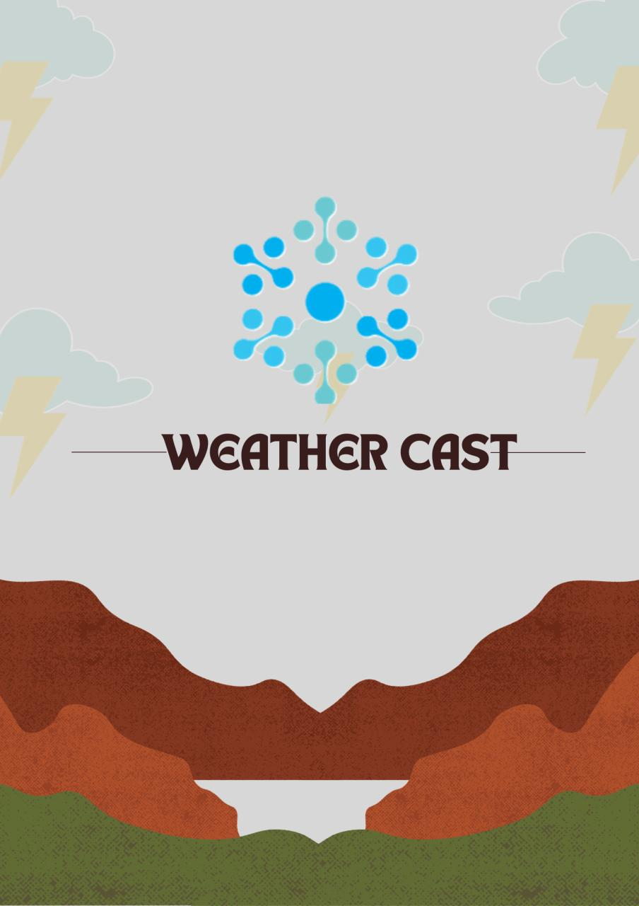
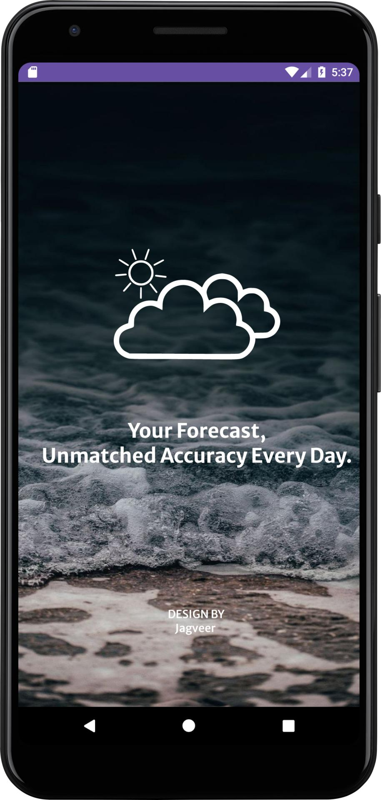
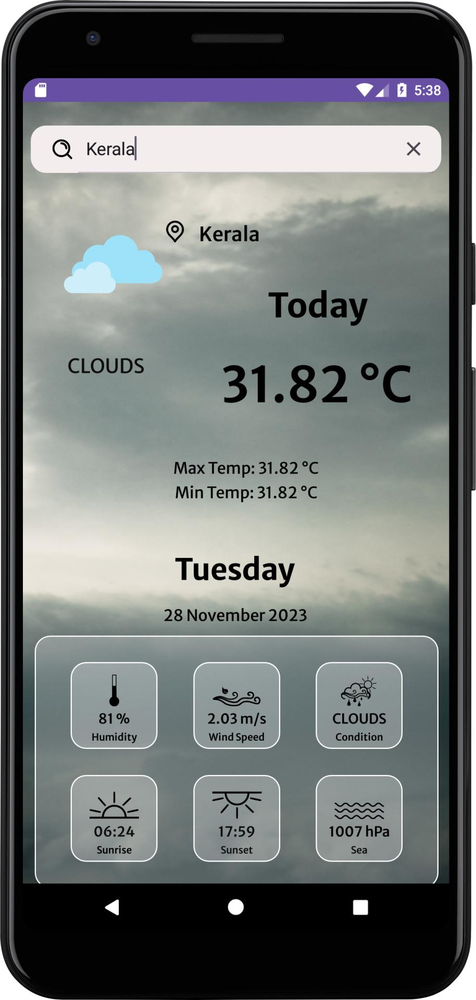
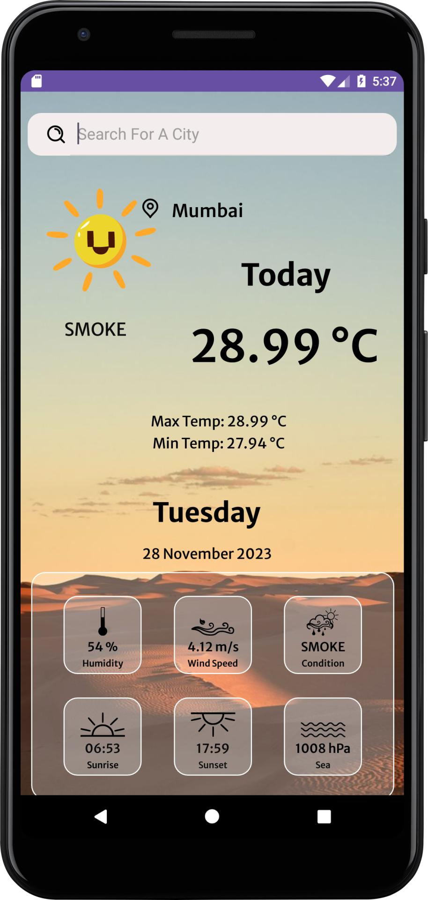

 <h1>Welcome to WeatherCast</h1>

  <p>Your go-to weather forecasting app that not only provides accurate weather information for your desired
        locations but also offers a visually stunning experience with dynamic background animations that change
        according to the current weather conditions.</p>

  <h2>Features</h2>
<ul>
        <li><strong>Location-based Weather Forecasting:</strong> Get real-time weather updates for any location of
            your choice.</li>
        <li><strong>Dynamic Background Animations:</strong> Immerse yourself in a visually appealing experience as
            the app dynamically changes background animations based on the current weather.</li>
        <li><strong>Lottie Animations:</strong> Enjoy smooth and engaging animations powered by Lottie, enhancing
            the overall user experience.</li>
    </ul>

 <h2>Screenshots</h2>
    
    <p><em>The logo of our app.</em></p>

  
    <p><em>The starting screen user would see upon starting the app.</em></p>

   
    <p><em>Few glimpses of weathers</em></p>

  
    <p><em>Few glimpses of our weather</em></p>

  <h2>Additional Information</h2>

 <p>In our App, you can also see the following details:</p>

  <ul>
        <li><strong>Wind Speed</strong></li>
        <li><strong>Sea Level</strong></li>
        <li><strong>Sunset and Sunrise Times</strong></li>
        <li><strong>Humidity</strong></li>
        <li><strong>Conditions</strong></li>
        <li><strong>Max and Min Temperature</strong></li>
        <li><strong>Date and Day</strong></li>
    </ul>

 <h2>Requirements</h2>

<ul>
     <li>Android device running Android 5.0 (Lollipop) or higher.</li>
        <li>Internet connection for real-time weather updates.</li>
    </ul>

<h2>Installation</h2>

<ol>
        <li>Download the WeatherCast APK from the <a href="https://github.com/jagv091205/WeatherCast/releases">release
                page</a>.</li>
        <li>Enable installation from unknown sources in your device settings.</li>
        <li>Install the WeatherCast APK on your Android device.</li>
    </ol>

<h2>Usage</h2>

 <ol>
        <li>Open the WeatherCast app on your Android device.</li>
        <li>Grant location permissions to allow the app to fetch weather information for your current location.</li>
        <li>Add your desired locations to receive weather forecasts.</li>
        <li>Explore the app's intuitive interface, complete with dynamic background animations that reflect the current
            weather conditions.</li>
    </ol>

<h2>Development</h2>

 <p>WeatherCast is developed using Kotlin and Java, a modern programming language for Android development. If you're
        interested in contributing or exploring the codebase, follow these steps:</p>

<ol>
        <li>Clone the repository:</li>
    </ol>

 ```bash
    git clone https://github.com/jagv091205/WeatherCast.git
   ```

 <ol start="2">
        <li>Open the project in Android Studio.</li>
        <li>Explore the codebase, make changes, and contribute to the development of WeatherCast.</li>
    </ol>

<h2>Acknowledgments</h2>

 <p>WeatherCast relies on various open-source libraries and APIs for accurate weather data and seamless animations.
        We extend our gratitude to the following:</p>

 <ul>
        <li><a href="https://openweathermap.org/api">OpenWeatherMap API</a> for providing reliable weather data.</li>
        <li><a href="https://github.com/airbnb/lottie-android">Airbnb Lottie</a> for enabling smooth and captivating
            animations.</li>
    </ul>

   <h2>Support and Feedback</h2>

  <p>If you encounter any issues, have suggestions, or want to contribute to the project, please feel free to <a
            href="https://github.com/jagv091205/WeatherCast/issues">open an issue</a> or submit a pull request.</p>

  <p>We appreciate your support and hope you enjoy using WeatherCast!</p>
    

  <p><em>WeatherCast - Your Weather, Your Way!</em></p>
